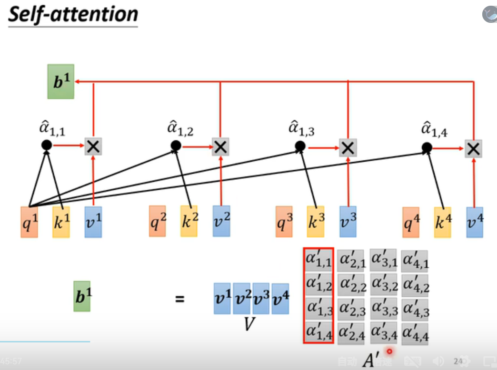

# 机器学习

**机器学习**

1. 回归和分类：回归预测具体数值；分类预测所属分类。
2. 逻辑回归：损失函数用交叉熵（非凸函数）不能用最小二乘法，因为非凸函数的特性使得其会陷入局部最优。（待定）交叉熵的原因是，loss的区别。cross-entropy可以随着目标轻松的梯度下降，而mse(mean square error)无法做到，因为mse在loss大的时候，难以轻松下降。

.png>)

1. 梯度下降：初始$$\theta$$,$$\theta$$针对各维度/参数求偏导，得到梯度L($$\theta$$)；=argmin L
2. Batch：随机分的批，一批一批的$$\theta$$梯度更新$$\theta$$。一个batch叫update，所有batch叫epoch
3. Sigmod指的是logisitic回归，relu指的是max(0,wx+b);relu更好。
4. 发现问题：（1）训练集loss大：欠拟合（模型不够复杂，因子/参数不够多，梯度下降的不够彻底；解决：可以通过不同的模型测试下）(2)训练集loss小测试集loss大：过拟合。
5. 过拟合解决方法：（1）更少的参数（特指神经元），更多的共享参数。（2）更少的特征。（3）早停止（early stopping）（4）正则化（5）dropout
6. gradient等于/接近0的原因：（1）local minima （2）saddle point

**局部最小值local minima和鞍点 saddle point**

1. 判断local minima/saddle point方法：采用泰勒二阶展开式。H(hessian)是正(eigen正)，local minima;H(hessian)是负(eigen负)，local maxima;反之，saddle point。
2. saddle point比local minima更加常见，因为存在许多负的eigen value。
3. saddle point解决方法：寻找负的eigen value（H）,顺着eigenvector寻找更小loss的数值。（运算量过大，不建议使用）

**Batch批处理和动量Momentum**

1. 1 **epoch** = see all the **batches** once -> **shuffle** after each epoch
2. small batch size，小批次，每步计算loss；big batch size，大批次，积累再计算loss。
3. **计算速度：**batch size过大的情况下，时间会很长；batch size处理合理区间，由于并行计算，时间差不多。但是整体来说，一个epoch，肯定是batch size大，计算更快。
4. **梯度下降：**small batch会noisy，large batch更稳定。
5. **准确度：**一般情况，batch size越大，训练和测试的准确度越低，由于过大的batch size会容易困在local minima，但是batch很多的情况下，相当于有很多条梯度下降曲线，一条卡住下一条不一定卡住。其中，测试的时候，small batch size表现更好，由于过拟合的情况。主要由于，训练的sharp minima 可能对应着测试的loss较大。large batch 会导致更容易走到sharp minuma, small batch 会导致更容易走到flat minima。
6. **动量：**能一定程度解决local minima和saddle point问题。gradient descent + momentum。

**自动调整学习速率**

1. training stuck != small gradient；训练卡住了，不一定是到了local minima或者saddle point，有可能是learning rate过大导致在跳跃（越过了最低点）
2. 损失函数陡峭处，希望小的learning rate；损失函数平缓处，希望大的learning rate。
3. 采用root mean square的方法，过去所有的g平方和开根号当作learning rate的分母。这个方法被用作adagrad。但没有考虑到一个theta也存在陡峭和平缓（gradient的变化）
4. RMSProp加入了alpha，改变了每个gradient的重要性。
5. Adam: RMSProp+Momentum。
6. 问题一，有些时候，theta会乱喷/偏离过大，所以通过learning rate scheduling解决，包括learning rate delay(即随着t增加,learning rate变小)；warm up,learning rate先变大再变小。
7. momentum也是把所有g加起来，区别是加入了方向/向量，而root mean square是只考虑大小。动量的原因是跳跃。

**分类的损失函数**

1. softmax，把y变成y'。y\_i'处于0-1之间。且相乘是1。softmax就是normalize。会让大值和小值的差距更大。两个类用sigmod和多类用softmax是一样的。
2. 分类采用cross entropy的原因：交叉熵的原因是，loss的区别。cross-entropy可以随着目标轻松的梯度下降，而mse(mean square error)无法做到，因为mse在loss大的时候，难以轻松下降。

.png>)

**批次标准化**

1. 梯度下降存在问题：首先从steep的参数开始下降，再去到smooth的参数下降。那我们期望w1和w2能同时平稳的下降。因此我们采用feature normalization。
2. 常见的标准化方式：item减去均值，除以标准差。
3. 在神经网络中，sigmod之前之后的隐藏层，也存在需要normalization的情况。sigmod中，推荐做z的normalization(sigmod之前)
4. batch normalization指的是一个batch里面进行feature normalization。
5. 实际业务过程中，无法通过整个batch获得均值和标准差，则通过移动平均的方式逐步更新均值和标准差。

**CNN**

1. 隐藏层实际上蕴含着局部的图片，比如鸟嘴。
2. 一张图片100\*100\*3色，receptive filed感受野指的是能看到的范围比如3\*3，5\*5，其中receptive filed是可以重复的。
3. kernel size，卷积核，比如3\*3。
4. 方法：由于边界被卷积核映射的不够，所以采用padding的方法补。
5. 方法：卷积核，我们可以共享参数。
6. 简化：实际上，CNN是一种简化。从fully connected network->receptive filed->parameter sharing。receptive filed + parameter sharing = convolutional layer卷积层。
7. 方法：pooling：最大池化，由于图片压缩几乎不变情况。
8. 方法：flatten，最后拉直了，fully connected
9. convolution->pooling->faltten.
10. CNN不能处理影像放大缩小问题。因此通过augmentation来增加 数据集。

**Self-Attention**

1. 自注意力应用在，输入的vector长度不一样的情况下。比如不同的语句。一堆vector。&#x20;
2. 在NLP中，one-hot encoding，向量过长，且假设所有词汇之间没有关系。
3. 在NLP中，word embedding，相似的词语会相近。
4. 输入和输出一致：输入n个vector，输出也是n个结果。例如，pos tagging(词性标注)。
5. 三种输出结果：（1）n个label (2)1个label（3）n个sequence
6. 不能单纯的用fully connected，因为不同的次序是不一样的，比如saw的词性在不同的语境下是不一样的，因此我们要考虑context的语境。
7. 其中，我们如果用传统的考虑上下文的方式，会导致序列过长的问题。
8. self-attention是考虑了整个序列的向量。self-attention有时可以和fully-conneccted结合在一起。
9. self-attention，生成需要考虑整个序列，其中，序列的两个向量需要计算相关性。
10. 相关性计算：计算alpha：dot-product（wq,wk；q.k）。additive（wq,wk;wq+wk;tanh,w）。
11. dot-product:计算a1和a1(自己),a2,a3,a4之间的alpha。计算四个alpha之后，需要做个softmax，获得新的alpha，alpha的意义是相关性大小，然后v1=wv\*a1,alpha1\*v1相加起来四个，则是b。意思就是，越相关的起到的作用越大。
12. 通过dot-product可知。self-attention就是通过一排序列得到新的一排序列(每个item包含所有序列内容，重要性是由相关性决定)

.png>)

13\. multi-head self-attention多头自注意机制：生成多个q,k,v；然后得到多个b，其中多个b通过w权重合为一个b\_i。

.png>)

14\. 问题：不含有位置的信息。解决方法：positional encoding。每个位置有一个ei vector，hand-crafted人设的。ei加在ai上。

15\. truncated self-attention： self-attention常常用在需要序列的情况下，比如nlp，语音识别不太合适，因为语音识别特别长，所以提出了truncated self-attention，可以控制序列长度。

16\. self-attention也可用在图片上，比如一张图片5\*10\*3，可以看作3个vector。

17\. self-attention是看全序列，CNN 是有视野域的。CNN是self-attention的特例。

18\. CNN和self-attention比较：比较flexible的model需要更多的data。小的model适合data少。实验结果显示，数据量少的情况下，cnn占有，数据量多的情况下，self-attention更好。

19.RNN和self-attention比较：self-attention是上帝视角看相关性，RNN是从头到尾的积累（每次输入包含上次的memory后的情况）。rnn需要记录最初的memory信息，此外，不能并行计算，耗费资源巨大。

20\. graph也可用self-attention，区别是，edge已经暗示了之间的关系，是一种GNN类型。

**Transformer**

1. seq2seq可以解决很多问题，比如机器翻译、情感分析等。听到台语声音转换成国内文字。seq2seq也可做syntactic parsing.
2. seq2seq一般涵盖encoder和decoder。
3. transformer，相比于self-attention，加入了residual部分，即b部分(注意力)+input，residual connection(a+b). -> norm/normalization(和batch normalization的区别是，batch是同维度不同x；layer normalization是不同维度的同个x）

.png>)

4\. encoder -> decoder:注意decoder输出的是比如所有汉字的概率，然后选择概率最大的作为下一个decoder的输入（之前需要做softmax获得最大概率）

.png>)

5\. transformer的encoder和decoder基本上类似，decoder多了masked self-attention和softmax。

.png>)

6\. masked self-attention指的是b只能考虑本身及之前的信息，而不能拿未来的信息。masked的原因是decoder是逐步生成的，而不是一步全部到位。

7\. decoder不知晓需要生成多少个字，因此存在一个end字。

8\. NAT(decoder,non-autoregressive)AT和NAT decoder的区别是，NAT一次性把整个句子展现。NAT的速度更快，而且能控制输出的长度。AT的表现比NAT比较好。

9\. Decoder链接encoder图示:

.png>)

10\. 训练过程：最后生成的汉字和实际结果，进行minimize cross entropy。\
11\. 有时候训练和测试的时候都需要加入杂讯。

12\. 训练的时候用cross entropy，测试的时候用blue score（两个句子做一个比较）

**生成对抗神经网络**

1. 生成式generator**：**

****

****

****

****

****

****

****

****

****

****

****

****

****

****

****

****

**强化学习**

1. 强化学习会知道什么输出是好的什么输出是差的。
2. actor观察环境并作出action，影响环境。
3. reward指的是采取某个行为得到的好处，return指的是整个reward总和。
4. 优化：env、actor不断迭代优化寻找最优，使得reward最大。

.png>)

5\. 控制actor，注意如果是不要做的行为，则取反cross-entropy。

.png>)
